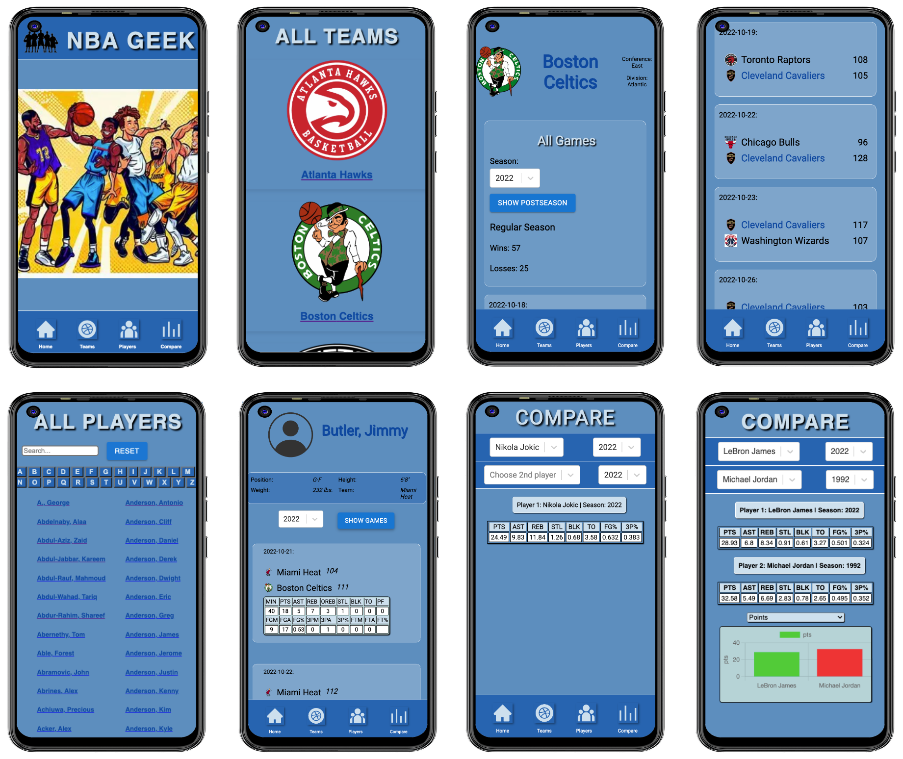

# NBA Geek

Introducing NBA Geek - an innovative web application that brings the fascinating world of NBA data right at your fingertips!

Developed as my capstone project during my [web development bootcamp](https://www.neuefische.de/bootcamp/web-development), this app is designed to captivate basketball enthusiasts and data lovers alike.

With NBA Geek, users can dive into a treasure trove of NBA data, spanning all the way back to 1946. Immerse yourself in a comprehensive collection of team information, game records, and player stats, allowing you to unravel the rich history of the league and its legendary figures.

This app utilizes the [balldontlie API](https://www.balldontlie.io/home.html#introduction) to retrieve real-time NBA statistics. A huge thank you goes out to balldontlie for generously providing this invaluable API, which serves as the backbone of this app's functionality! &#x1F60A;

## Functionality

As of now these are the core features:

- Find and filter all teams and games
- Search for specific players and performances
- Compare individual player stats

## TechStack

## Deployment

You can find the hosted version on Vercel: [NBA Geek on Vercel](https://nba-geek-mzschunke-s-team.vercel.app)

Important: This demo is optimized for mobile screen.

### Local development

To run project commands locally, you need to install the dependencies using `npm i` first.

You can then use the following commands:

- `npm run dev` to start the development server
- `npm run build` to create a production build
- `npm run start` to start the production build

> 💡 This project requires a bundler. You can use `npm run dev` to start the development server. You can then view the project in the browser at `http://localhost:3000`.
